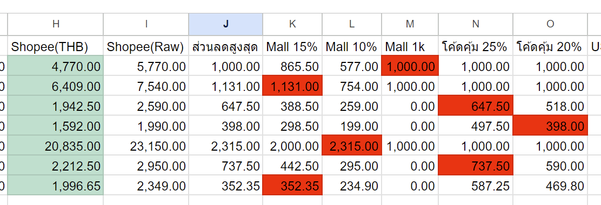
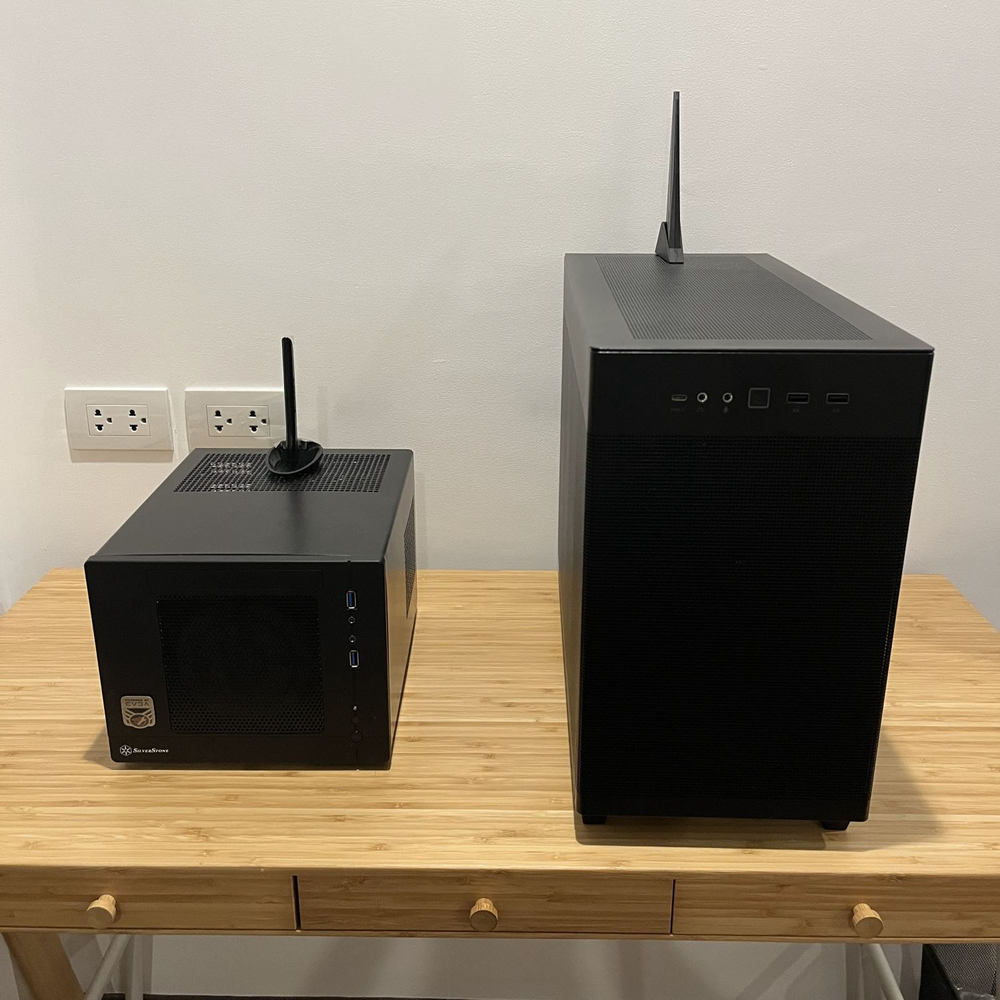

เมื่อปลายปีที่แล้ว ประกอบ PC เครื่องใหม่ สาเหตุที่อยากได้เครื่องใหม่เพราะ

* อยากได้เครื่องเล่นเกม เบื่อ Nintendo Switch ที่เล่นอยู่
  * ตอนแรกจะรอ Switch 2 แต่ดูแววแล้ว คงปีกว่า กว่าจะออก
  * มีดูๆ PS5 ไว้ด้วย แต่ดูจากเกมที่ตัวเองชอบเล่นแล้ว ไม่เหมาะ
* เครื่องเดิมจะ 10 ปีแล้ว และ Mac Mini ที่ซื้อมาใช้แทนก็เล่นเกมไม่ได้
  * Mac Mini ที่ไม่ค่อยได้ใช้ก็ขายต่อไป

## ความต้องการ

เริ่มวางความต้องการของตัวเองก่อน สิ่งที่ต้องการคือ

* เล่น PC Game ปัจจุบันที่อยากเล่นได้ แบบ 4K เช่น
  * Tekken 8 (4k Ultra Settings)
  * Flight Simulator 2020
  * Hogwart Legacy
  * Baldur Gate's 3
  * Witcher 3
* ใช้เป็นเครื่องหลัก เล่นเน็ต เขียนโปรแกรม ทั่วไปได้ อันนี้ง่าย
* งบไม่เกิน 45k

หลังจาก research อยู่ 2 อาทิตย์ ก็ได้สเปคมาตามนี้

* Motherboard:	[ASUS TUF GAMING B760M-PLUS WIFI (DDR5)](https://pcpartpicker.com/product/gvn9TW/asus-tuf-gaming-b760m-plus-wifi-micro-atx-lga1700-motherboard-tuf-gaming-b760m-plus-wifi)
* CPU:	[Core i5-13400F](https://pcpartpicker.com/product/VNkWGX/intel-core-i5-13400f-25-ghz-10-core-processor-bx8071513400f)
* Case:	[Asus PRIME AP201 Black mesh](https://pcpartpicker.com/product/fPZ9TW/asus-prime-ap201-microatx-mini-tower-case-ap201blkmesh)
* Power supply:	[(80+ BRONZE) 650W ASUS TUF GAMING 650B](https://pcpartpicker.com/product/Dn8bt6/asus-tuf-gaming-650-w-80-bronze-certified-atx-power-supply-tuf-gaming-650b)
* GPU:	[Asus DUAL RTX 4070](https://pcpartpicker.com/product/nhtLrH/asus-dual-oc-geforce-rtx-4070-12-gb-video-card-dual-rtx4070-o12g)
* Ram:	[KINGSTON FURY BEAST DDR5 5600 16GBx2](https://pcpartpicker.com/product/4TfnTW/kingston-fury-beast-32-gb-2-x-16-gb-ddr5-5600-cl40-memory-kf556c40bbk2-32)
* SSD:	[WD BLACK SN770 1TB](https://pcpartpicker.com/product/YVytt6/western-digital-1-tb-m2-2280-nvme-solid-state-drive-wds100t3x0e)
* Fan: [be quiet! Silent Wings 3 PWM 140mm](https://pcpartpicker.com/product/bkJkcf/be-quiet-bl067-595-cfm-140mm-fan-bl067) (ซื้อเพิ่มหลังประกอบ)
* Fan: 2 x [ARCTIC P12 SLIM PWM PST 120mm](https://pcpartpicker.com/product/YCbTwP/arctic-p12-slim-pwm-pst-411-cfm-120-mm-fan-acfan00187a) (ซื้อเพิ่มหลังประกอบ)

ดูรายการทั้งหมดได้ [ที่นี่](https://pcpartpicker.com/list/Xn3FN6)

พบว่าเว็บชื่อ [PCPartPicker](https://pcpartpicker.com/) นี่ดีมาก คือเลือกชิ้นส่วนต่างๆ นอกจากโชว์ราคา(ต่างประเทศ)แล้วมันเช็ค compatability ให้ด้วย ระดับว่ามี socket/port เสียบสายพอมั้ย มีคำเตือนระยะ dimension จะมีปัญหาของชิ้นส่วนจะมีปัญหากันรึเปล่า

## จัดซื้อ

ลองทำตารางเทียบราคาดู ระว่างซื้อหน้าเว็บ JIB/Advice ตรงๆกับซื้อผ่าน Official Store ต่างๆบน Shopee แล้วก็พบว่า Shopee ถูกกว่าพอควร คือหลังจาก optimize คูปองลดราคาต่างๆ ลดไปได้ 6,5xx บาท รู้สึกคุ้มค่าที่นั่งทำตาราง

เริ่ม execute สั่งของต่างๆตอน 11.11 แล้วรอของมาส่งทีละชิ้นสองชิ้น

สุดท้ายจบรวมที่ราคา 41,xxx บาท (ไม่รวม Windows) อยู่ในงบ แฮปปี้ :D

## ประกอบ

วัตถุดิบมาครบ เริ่มประกอบได้ ขลุกขลักตามปกติ แม้จะประกอบมาหลายรอบแล้วก็ตาม (เพราะความ OCD ส่วนตัวด้วย)

ปกติผมจะตั้งชื่อเครื่อง/อุปกรณ์ไอทีตามตัวละครดราก้อนบอล เครื่องนี้เลือกใช้ชื่อ [Tenshinhan](https://dragonball.fandom.com/wiki/Tien_Shinhan) (เทนชินฮัง) ไม่มีเหตุผลอะไรพิเศษ

สุดท้าย ถ่ายรูปคู่ระหว่างรุ่นพี่ Goten (ซ้าย) กับรุ่นน้อง Tenshinhan (ขวา) ไว้ซักหน่อย เป็นอันจบ

