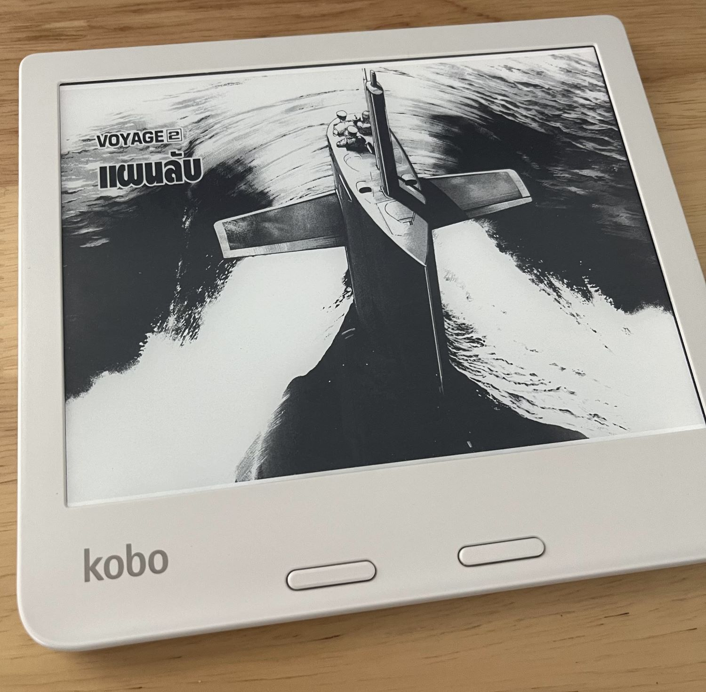

ช่วง 2-3 อาทิตย์ที่ผ่านมา นั่งทำโปรเจคใหม่ของตัวเอง ชื่อว่า [mangafmt](https://github.com/teerapap/mangafmt)
เป็นโปรแกรมไว้แปลงไฟล์หนังสือการ์ตูน (บนอินเทอร์เน็ตเรียกตามญี่ปุ่นว่า [มังงะ/Manga](https://en.wikipedia.org/wiki/Manga)) เพื่อให้อ่านบน [E-ink reader](https://en.wikipedia.org/wiki/E-reader) ได้สวยงามและสะดวกมากขึ้น

นั่งทำช่วงหลัง 3 ทุ่มเป็นต้นไปของแต่ละวัน เรียกว่าหมกมุ่นได้เลย แทบไม่ได้เล่นเกม/ดูซีรียส์ ขับรถก็คิดถึง ว่าจะทำออกมายังไงดี ใช้วิธีไหนดี บางคืนคิดถึงจนนอนไม่หลับ ไม่ได้สนุกกับการเขียนโปรแกรมแบบนี้มานานมากแล้ว ได้ทำสิ่งที่เราอยากได้เอง กำหนดเองได้ว่าจะทำอะไรหรือไม่ทำอะไร จะทำออกมาแบบไหน

## โปรแกรมทำอะไรได้บ้าง

ตอนนี้ [v0.2.1](https://github.com/teerapap/mangafmt/releases) เสร็จแล้ว สิ่งที่ทำได้คือ

* **(ฟีเจอร์เด็ด)** ตรวจจับหน้าคู่ได้ (แบบคร่าวๆ) แล้วเอา 2 หน้ามาต่อกันกลายเป็นหน้าใหญ่หน้าเดียวตามแนวนอนได้
  * หน้าคู่คือ คนวาดจะวาดใช้พื้นที่ 2 หน้าต่อกัน ซึ่ง e-reader โดยทั่วไปมันแสดงได้ทีละหน้า ทำให้เวลาอ่านจริงๆเสียอรรถรสอยู่พอสมควร เพราะฉากหน้าคู่มักจะเป็นฉากที่มี impact แต่ดันเห็นแค่ทีละครึ่ง
  
* ย่อขนาดรูปให้เหมาะกับขนาดจอ รวมทั้งหมุนรูปด้วยถ้าเป็นแนวนอน
* ตัดขอบพื้นที่สีขาวว่างๆของแต่ละหน้าได้ (เรียกว่า trim) เพื่อจะใช้พื้นที่บนจอเล็กๆได้คุ้มขึ้น ตัวหนังสือจะใหญ่ขึ้นอีกหน่อย
* ลดจำนวนสีเป็นขาวดำ 16 สี (4-bits grayscale) เพราะจอ e-reader มันแสดงภาพสีไม่ได้
* รองรับไฟล์ที่อ่านจากขวาไปซ้าย (เปิดแบบหนังสือการ์ตูนญี่ปุ่น)
* แปลงไฟล์เป็น EPUB/KEPUB/CBZ

## มายังไง ทำไปทำไม

พอดีเริ่มหันมาอ่านการ์ตูนบน [Kobo Libra 2](https://gl.kobobooks.com/products/kobo-libra-2) ที่ตัวเองมี โดยซื้อการ์ตูนจาก [Google Play Books](https://play.google.com/store/books/?hl=en) แปลงไฟล์นิดหน่อย แล้วได้มาเป็นไฟล์ PDF แต่พอเปิดอ่านในเครื่องก็พบว่า เวลาเปลี่ยนหน้ามัน lag นิดหน่อยเพราะเป็น PDF คนบนเน็ตก็แนะนำให้แปลงไฟล์เป็น EPUB/KEPUB แล้วจะลื่นขึ้น (ซึ่งจริง) ลองใช้โปรแกรมที่เค้านิยมกันชื่อ [KCC](https://github.com/ciromattia/kcc) แปลงดู

ก็พอใช้งานได้ แต่ไม่ค่อยถูกใจ เพราะบางหน้ามันตัดขอบผิดแล้วตัวหนังสือหายบ้าง หรือบางทีก็ตัดแล้วหน้าขาดไปเลย จะแก้ bug ให้ก็ไม่ไหว เพราะ KCC เขียนด้วย Python ซึ่งไม่สันทัดเท่าไหร่

เลยคิดว่าทำ tool ของตัวเองเลยแล้วกัน ไม่น่ายากนะ

## เขียนด้วย Go / ImageMagick

ตอนแรกเขียนด้วย [bash script](https://en.wikipedia.org/wiki/Bash_(Unix_shell)) ง่ายๆ คิดว่า 2-3 วันก็เสร็จ เพราะใช้คำสั่ง [convert](https://imagemagick.org/script/convert.php) อันทรงพลังของ [ImageMagick](https://imagemagick.org/) ได้ แต่พอทำไปเรื่อยๆ เริ่มต้องคำนวนพวกขนาดกับพิกัดเยอะ bash เริ่มไม่เหมาะ ลองเขียนด้วยภาษาที่สูงกว่านี้ดีกว่า

อยากลองเขียน [Go](https://go.dev/) มานานแล้ว เคยลองหัดแล้ว แต่ไม่มีโปรเจคให้ทำ สุดท้ายก็ลืม โปรเจคนี้เลยเหมาะมาก เพราะตั้งใจทำเป็น CLI และขอบเขตงานใหญ่กำลังดี เลยได้ลองเขียน Go จริงๆ ซึ่งสนุกมาก ไว้จะมาเขียนแยกเป็นอีกโพสวันหลัง

เอาจริงๆ เวลาส่วนใหญ่ที่ใช้ทำหมดไปกับการหัดใช้ [ImageMagick API](https://imagemagick.org/script/magick-wand.php) ซะมากกว่า คือมันทรงพลัง แต่ก็มี caveat เยอะพอสมควร เวลาที่ใช้หัด Go นิดเดียวเพราะเคยอ่านมาแล้วกับเว็บ [Go by Example](https://gobyexample.com/) ช่วยได้มาก

## ทำอะไรต่อ

เวอร์ชั่นแรกนี้ มันทำสิ่งที่อยากทำตอนแรกได้หมดแล้ว แต่ก็มีอยากทำเพิ่มอีก เช่น 

* แทนส่วนที่เป็น ImageMagick ด้วย pure Go เพราะจะได้ build ง่ายขึ้น และได้ portable executable (ไม่ต้องลง lib เพิ่ม)
* ทำเวอร์ชั่น Windows / OSX
* ทำตัว detect หน้าคู่ ให้เก่งขึ้น ฉลาดขึ้น

ไว้จะค่อยๆ ทำต่อไปวันหลัง ตอนนี้อ่านการ์ตูนก่อน
